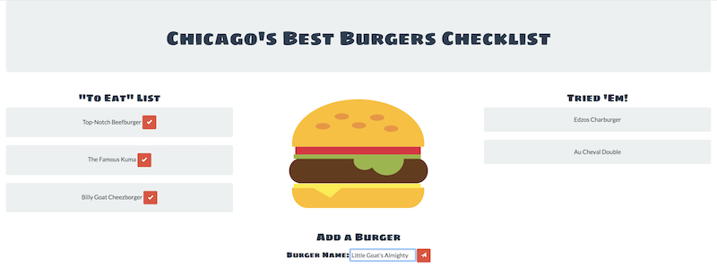
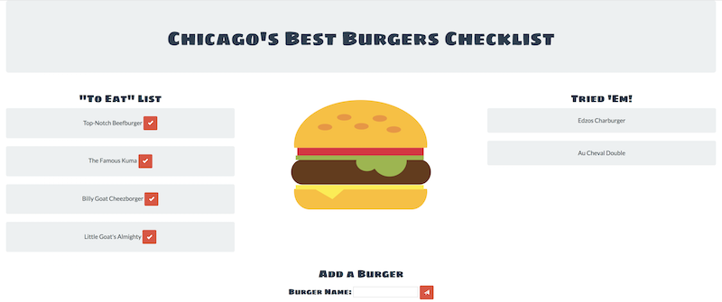
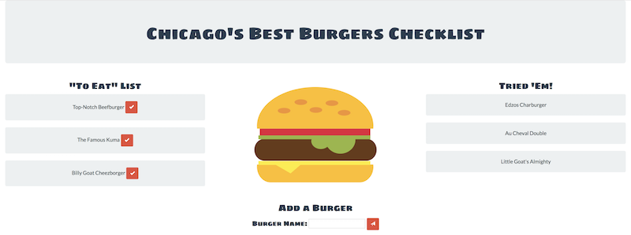

# burger
NU CBC Homework #12 - Week #14 - Full Stack App (MySQL, Node, Express, Handlebars &amp; ORM)

The Chicago Burger Checklist was my first full stack application incorporating express, handlebars, and mySQL. The application requires the following npm packages:

* express
* express-handlebars
* mysql
* body-parser

After eating one of the famous burgers, click the check mark next in the "To Eat List" and it will change the value of "devoured" in the database from false to true. The burger will then be displayed in the "Tried 'Em" column.

You can add a new burger to the "To Eat List" by entering the name in the form at the bottom of the page.

The added burger has all the functionality of the pre-populated burgers!

